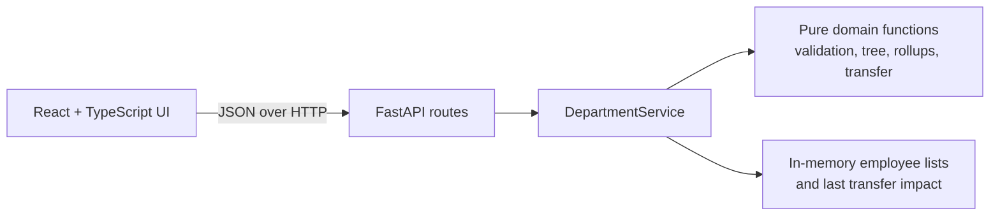

# Departmental Reorg Payroll Rollup Tracker

A local tool for exploring a department's reporting structure, complete-team payroll, and the effect of a proposed reporting-line change.

## The Problem

A department administrator may have employee records as a flat list, while the questions they need answered are hierarchical: who belongs to each team, what the team costs, and what changes after a reorganisation. Updating a reporting line can also accidentally create a cycle or move the department head. This project turns a flat list into a validated reporting tree and makes those outcomes visible before a change is applied.

## The Solution

The application loads a deterministic employee scenario, derives the reporting tree and rollups on the backend, and lets the user preview or apply a transfer.

- Validates a flat employee list in a defined first-error order.
- Calculates complete-team headcount and monthly payroll for every employee.
- Previews and applies transfers without allowing root moves or cycles.
- Shows the moved team and only the rollups whose values changed.
- Supports adding an employee and deleting a leaf employee in the current in-memory session.

## How It Works

User chooses a scenario → React calls FastAPI → the service validates the records and derives a tree and rollups → React renders the returned snapshot → a transfer is validated against a candidate copy → the backend recomputes rollups and commits only a valid candidate.

## Architecture



- The React client handles interaction and presents backend snapshots; it does not calculate hierarchy or payroll.
- FastAPI exposes the local API and maps domain state to response models.
- `DepartmentService` coordinates load, preview, transfer, reset, add, and delete operations.
- Pure Python domain modules contain the validation and reporting rules.

## Tech Stack

| Technology | Use |
| --- | --- |
| React, TypeScript, Vite | Interactive local UI |
| FastAPI, Pydantic | Local HTTP API and response/request shapes |
| Python dataclasses | Domain records and derived values |
| pytest, Vitest, Testing Library | Backend and frontend tests |

## Running Locally

Prerequisites: Python 3 and Node.js with npm. No database, external service, or environment variables are required.

```sh
# Terminal 1: backend
cd backend
python3 -m venv .venv
source .venv/bin/activate
pip install -r requirements.txt
uvicorn app.main:app --reload --port 8000

# Terminal 2: frontend
cd frontend
npm ci
npm run dev
```

Open `http://localhost:5173` and load **Main 12-person department**.

```sh
# Checks
cd backend && .venv/bin/pytest -q
cd frontend && npm run test -- --run && npm run build && npm run lint
```

## Demo

Load `main-12`, then stage `LEAD_A → MGR_C` and preview or apply it. The moved subtree has three people and INR 145,000 monthly payroll; `MGR_A` falls from 5 to 2 people while `MGR_C` rises from 2 to 5. Then attempt `MGR_A → E3` to see the cycle rejection without changing the loaded department. `docs/EXPECTED_RESULTS.md` contains the exact expected values.

## Design Notes

- [Implementation plan](docs/IMPLEMENTATION_PLAN.md)
- [Design](docs/DESIGN.md)
- [AI usage](docs/AI_USAGE.md)
- [Testing](docs/TESTING.md)

The original assignment, detailed API/design record, and historical evidence remain in `Student_SPR26_D2_P04-departmental-reorg-payroll-rollup-tracker.md`, `ARCHITECTURE.md`, and `docs/TEST_EVIDENCE.md`.
