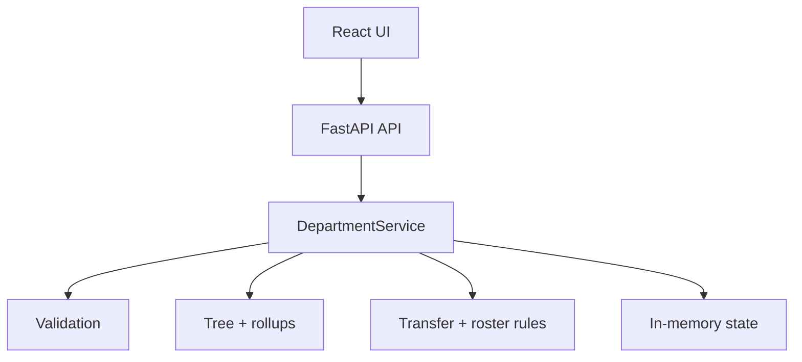

# Design

## Architecture

The browser renders typed API responses and holds UI-only state such as selection, staged input, and panel state. `DepartmentService` owns the loaded records and derives a fresh tree and rollups whenever it exposes state. The domain modules are pure Python and do not depend on FastAPI or Pydantic.

## Main Request / Data Flow

1. The user selects a scenario and sends `POST /api/department/load`.
2. The service validates its ordered employee records, then builds the reporting tree and rollups.
3. FastAPI returns one normalized department snapshot for the UI to render.
4. A preview or transfer validates the requested move against the current tree.
5. For a valid move, the service creates a candidate list, recomputes every rollup, calculates an exact diff, then commits it. A rejected request never assigns the candidate.

## Key Technical Decisions

### Decision: Keep a flat employee list as canonical state

**Why I chose it**

A transfer changes one `manager_id`; the tree and its aggregates can be derived from the same ordered list.

**Alternative considered**

Store a mutable nested organisation tree.

**Trade-off**

Tree and rollups are rebuilt for every state read, but the assignment caps a department at 30 employees, so that cost is small and avoids synchronising two mutable structures.

### Decision: Put domain calculations on the backend

**Why I chose it**

Validation order, subtree membership, payroll totals, and transfer effects have one source of truth and can be tested without HTTP or React.

**Alternative considered**

Recalculate rollups in the client for immediate display.

**Trade-off**

The UI waits for an API response, but it cannot drift from the rules used to commit a transfer.

### Decision: Validate a candidate before committing it

**Why I chose it**

The service can reject an invalid transfer without rollback code or partially changed state.

**Alternative considered**

Mutate the current list first and restore it if later checks fail.

**Trade-off**

Candidate creation and full recomputation do a little extra work, but the control flow is easier to inspect and test.

### Decision: Report changed rollups by direct comparison

**Why I chose it**

Comparing every employee's before/after values identifies the exact changed set. It correctly excludes the shared root after an internal cross-branch move.

**Alternative considered**

Walk ancestor paths from the old and new managers.

**Trade-off**

The approach recomputes and compares all records rather than only likely ancestors, which is appropriate for a 30-person department.

### Decision: Keep state in memory

**Why I chose it**

The task is a local, single-session interview exercise and needs deterministic reset behavior rather than persistence.

**Alternative considered**

Add a database and per-user state.

**Trade-off**

Data disappears on restart and concurrent users share the process state; neither is addressed in this scope.

## What I Intentionally Kept Simple

- No authentication, roles, or audit trail: the project models one local administrator session.
- No database or migration path: scenarios are deterministic in-memory fixtures and reset is part of the demo.
- No queues, caching, or incremental aggregates: full computation is inexpensive at the stated size limit.
- No general editing workflow: the only roster operations are add and leaf delete, keeping hierarchy rules easy to reason about.

## If I Had More Time

- Persist departments and add explicit user/session ownership.
- Add request-level logging and structured error telemetry.
- Add keyboard-accessible alternatives and browser-level tests for all drag interactions.
- Version reorganisation changes with an audit history and undo.
